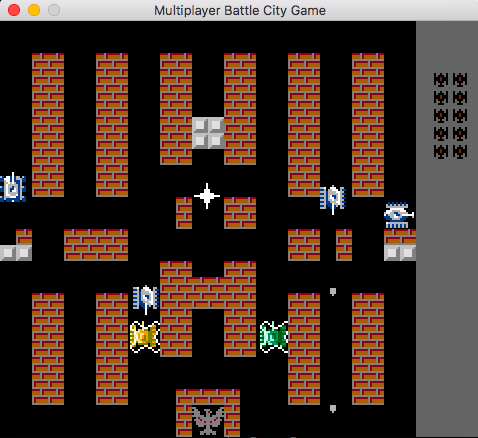

# Classic BattleCity in Multiplayer mode

## Build and run game server

From repo, `server` folder, to build: 

    mkdir ./build
    cd build
    cmake ..
    make

To run game server: 

    ./tank-server

## Run game client

In `client` folder, run the python client by: 

    python tank.py

The game will start when there are two players join the game on the same server
